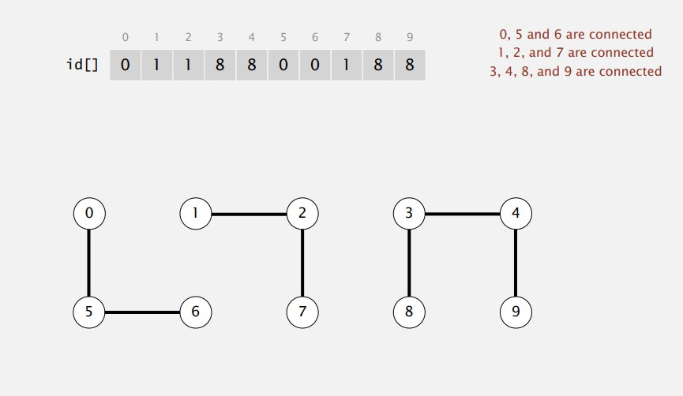

# Algorithms

## Algorithm: 
method for solving a problem.

## Data structures:
method to store information.

## Steps to develop a usable algorithm:
1. Model the problem
2. Find an algorithm to solve it.
3. Fast enough? Fits in memory?
4. If not, figure out why.
5. Find a way to address the problem
6. Iterate until satisfied.

## Union - find

#### Dynamic Connectivity
Given a set of N objects.
    
   1. **Union command:** connect two objects.
   2. **Find/connected query:** is there a path connecting the two objects?
   
Assumptions while modeling the connections
* Reflexive: p is connected to p.
* Symmetric: if p is connected to q, then q is connected to p.
* Transitive: if p is connected to q and q is connected to r, then p is connected to r.

Connected components: Maximal set of objects that are mutually connected.

.

#### Implementing the operations:
* Find query: Check if two objects are in the same component.
* Union command: Replace components containing two objects with their union.

### Union-find data type (API)-
Goal: Design efficient data structure for union-find.
* Number of objects *N* can be huge.
* Number of operations *M* can be huge.
* Find queries and union commands may be inter-mixed.

#### Quick-Find:
**Data structure:**
* Integer array nodes[] of length N
* Interpretation: p and q are connected iff (if and only if) they have the same id.

**Find:** Check if p and q have same id.
**Union:** To merge components containing p and q, change all entries whose id equals id[p] to id[q]

 

**Code:**
[Quick Find Code](src/interview/prep/algorithms/QuickFind.java)

**Observations:**

* Quick-find is too slow.

* Cost model: Number of array accesses (for read or write)

algorithm | initialize  | union | find
--------- | ------------|-------|--------
quick-find | N | N | 1

* **Union is too expensive:** It takes N2 array accesses to produce a sequence of N union commands on N objects.

**Defect:**
* Union is too expensive (N array access).
* Trees are flat, but too expensive to keep them flat.

### Quadratic algorithms do not scale
* New computer may be 10x as fast.
* But, has 10x as much memory - want to solve a problem that is 10x as big.
* With quadratic algorithm, takes 10x as long!

#### Quick-Union:

**Data structure:**
* Integer array id[] of length N.
* Interpretation: id[i] is parent of i.
* Root of i is id[id [id [... id[i]...]]]

**Find:** Check if p and q have the same root.

**Union:** To merge components containing p and q, set the id of q's root.

**Code:**
[Quick Union Code](src/interview/prep/algorithms/QuickUnion.java)

**Observations:**
* Quick union is also too slow.
* **Cost model:** Number of Array accesses (for read or write)

algorithm | initialize  | union | find
--------- | ------------|-------|--------
quick-union | N | N (includes cost of finding roots) | N (Worst case)

**Defect:**
* Trees can get tall.
* Find is too expensive (could be N array accesses).

#### Weighted quick union:

* Modify quick union to avoid tall trees.
* Keep track of size of each tree (number of objects).
* Balance by linking root of smaller tree to root of larger tree.

##### Quick union vs. weighted quick union tree height comparision:

**Data structure:**
* Same as quick union.
* Maintain an extra array to count number of objects in the tree rooted at current index.

**Find:** Check if p and q have the same root. (Identical to quick union)

**Union:** 
* Link root of smaller tree to root of larger tree.
* Update the size array.

**Code:**
[Weighted Quick Union Code](src/interview/prep/algorithms/WeightedQuickUnion.java)

**Observations:**
**Running Time:** 
* Find: takes time proportional to depth of p and q.
* Union: takes a constant time, given roots.

**Preposition:** Depth of any node x is at most lg *N*.

algorithm | initialize  | union | find
--------- | ------------|-------|--------
weighted quick-union | N | lg N (includes cost of finding roots) | lg N 

#### Weighted quick union with path compression:

* Just after computing the root of p, set id if each examined node to point that root.

**Code:**
[Weighted Quick Union Code Path Compression](src/interview/prep/algorithms/WeightedQuickUnionPathCompression.java)
